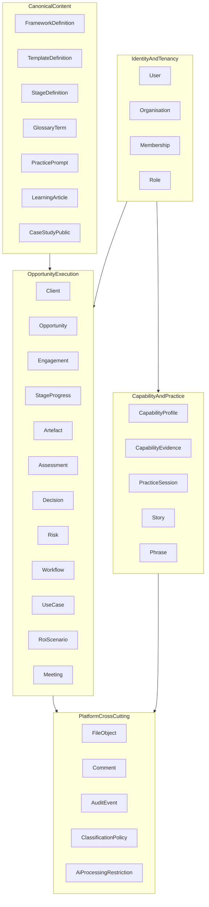
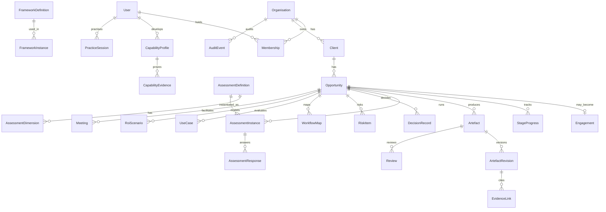

# Conceptual data model

**Product:** AI Playbook  
**Companion:** [Sitemap and page specification](./sitemap-and-page-specification.md)  
**Horizon:** Future-ready multi-tenant team platform (V4), with V1 content fields marked separately  
**Current prototype persistence:** browser `localStorage` key `sudip-consult-workspace` — **not** a security or multi-tenant boundary

---

## 1. Bounded contexts

| Context | Owns | Does not own |
| --- | --- | --- |
| Identity & tenancy | Users, orgs, memberships, roles, invitations | Opportunity business content |
| Canonical content | Published framework/template/stage definitions (global or org-published) | Filled-in client answers |
| Opportunity execution | Client work, stages, artefacts, risks, decisions | Public marketing pages |
| Capability & practice | Personal/org skill evidence, practice history, stories/phrases | Client confidential engagement data (except anonymised promotion) |
| Platform cross-cutting | Files, comments, audit, classification, AI restrictions | Domain rules for scoring |

---

## 2. Entity-relationship overview

---

## 3. Version applicability

| Marker | Meaning |
| --- | --- |
| **V1** | Content definition only (may be static JSON/MD in repo) |
| **V2** | Persisted per authenticated user / personal workspace |
| **V3** | AI coaching metadata (critiques, scores, detections) |
| **V4** | Multi-user sharing, approvals, org libraries, benchmarks |

Every entity below lists **Min version**.

---

## 4. Identity and tenancy

### 4.1 User

| Attribute | Type | Notes |
| --- | --- | --- |
| `id` | UUID | Primary key |
| `email` | string | Unique |
| `displayName` | string | Required |
| `status` | enum | `invited` \| `active` \| `suspended` \| `deleted` |
| `createdAt` / `updatedAt` | datetime | |
| Min version | V2 | |

**Constraints:** Soft delete; email unique among non-deleted.  
**Classification:** Personal data (PII).

### 4.2 Organisation (tenant)

| Attribute | Type | Notes |
| --- | --- | --- |
| `id` | UUID | Tenant root |
| `name` | string | |
| `slug` | string | Unique |
| `status` | enum | `active` \| `suspended` \| `closed` |
| `retentionPolicyId` | UUID | FK |
| Min version | V4 (V2 may use personal org of one) | |

**Tenant boundary:** All opportunity execution rows carry `organisationId`. Queries always filter by tenant.

### 4.3 Membership

| Attribute | Type | Notes |
| --- | --- | --- |
| `id` | UUID | |
| `organisationId` | UUID | |
| `userId` | UUID | |
| `role` | enum | See roles |
| `status` | enum | `active` \| `revoked` |
| Min version | V4 | |

**Roles (V4):** `org_admin` · `manager` · `contributor` · `reviewer` · `reader`  
**V2 personal mode:** implicit `contributor` on own personal organisation.

### 4.4 WorkspaceAccess (opportunity ACL)

| Attribute | Type | Notes |
| --- | --- | --- |
| `opportunityId` | UUID | |
| `userId` | UUID | |
| `accessLevel` | enum | `owner` \| `editor` \| `commenter` \| `viewer` |
| Min version | V4 | |

---

## 5. Canonical content definitions

These are **authoring-time** definitions, separate from tenant execution records.

### 5.1 StageDefinition (8D)

| Attribute | Type | Notes |
| --- | --- | --- |
| `id` | slug | `define` … `deliver` |
| `order` | int | 1–8 |
| `title` | string | |
| `purpose` | string | |
| `questions` | string[] | |
| `tools` | string[] | Framework/template refs |
| `requiredOutputs` | string[] | Artefact type codes |
| `stageGate` | string | Gate statement |
| `legacyStageIds` | string[] | e.g. `stage-3`, `stage-4` |
| `commonMistakes` | string[] | |
| `communicationExerciseId` | slug? | |
| Min version | V1 | |

### 5.2 LegacyStageDefinition

Maps existing `CONSULTING_STAGES` (`stage-0`…`stage-19`) for deep content: purpose, questions, frameworks, actions, deliverables, gate, gateCriteria.  
**Min version:** V1 (content); surfaced under `/app/legacy/stages/:stageId`.

### 5.3 FrameworkDefinition

| Attribute | Type | Notes |
| --- | --- | --- |
| `id` / `slug` | string | Stable |
| `name` | string | |
| `jobCategory` | enum | `understand` \| `diagnose` \| `prioritise` \| `communicate` \| `deliver` |
| `stageIds` | slug[] | 8D links |
| `whenToUse` | string | |
| `howToUse` | string | |
| `antiPatterns` | string[] | |
| `canvasType` | string? | Links to specialized canvas |
| `version` | semver | Immutable published versions |
| `visibility` | enum | `public` \| `org` |
| `organisationId` | UUID? | Null for global |
| Min version | V1 | |

### 5.4 TemplateDefinition

| Attribute | Type | Notes |
| --- | --- | --- |
| `slug` | string | |
| `title` | string | |
| `stageId` | slug | |
| `stakeholderTypes` | string[] | |
| `industries` | string[] | |
| `deliverableType` | string | |
| `meetingType` | string? | |
| `complexity` | enum | `low` \| `medium` \| `high` |
| `visibility` | enum | `public` \| `private_org` |
| `bodySchema` | JSON schema | Fields for instances |
| `version` | semver | |
| Min version | V1 | |

### 5.5 GlossaryTerm, LearningArticle, CaseStudyPublic, PracticePrompt

Standard CMS-like content entities with `slug`, `body`, `relatedStageIds`, `relatedFrameworkIds`, `status` (`draft`\|`published`), **V1**.  
Case studies use the 10-section structure from the sitemap. No real client PII.

---

## 6. Opportunity execution entities

### 6.1 Client

| Attribute | Type | Notes |
| --- | --- | --- |
| `id` | UUID | |
| `organisationId` | UUID | Tenant |
| `name` | string | Confidential |
| `industry` | string | |
| `geography` | string | |
| `classification` | enum | Default `confidential` |
| `status` | enum | `active` \| `archived` |
| Min version | V2 | Maps from `ClientRecord` |

### 6.2 Opportunity

Primary workspace unit (product vision “Opportunity Workspace”).

| Attribute | Type | Notes |
| --- | --- | --- |
| `id` | UUID | |
| `organisationId` | UUID | |
| `clientId` | UUID | |
| `name` | string | |
| `description` | string | |
| `currentStageId` | slug | 8D |
| `status` | enum | `qualifying` \| `active` \| `on_hold` \| `won` \| `lost` \| `closed` |
| `sponsorUserId` | UUID? | |
| `ownerUserId` | UUID | |
| `pursuitDecision` | enum? | `pursue` \| `nurture` \| `decline` |
| `estimatedValue` | decimal? | Assumption-labelled |
| `targetDecisionDate` | date? | |
| `doNotSendToAi` | boolean | Default false; workspace-level override |
| `classification` | enum | `public_practice` \| `internal` \| `confidential` \| `restricted` |
| `legacyEngagementId` | string? | Migration |
| `rowVersion` | int | Optimistic concurrency |
| Min version | V2 | |

**Relationship:** Optional 1:1 `Engagement` when commercial engagement is contracted; qualification can exist without engagement.

### 6.3 Engagement

| Attribute | Type | Notes |
| --- | --- | --- |
| `id` | UUID | |
| `opportunityId` | UUID | Unique |
| `engagementName` | string | |
| `scopeIn` / `scopeOut` | text | |
| `situationId` | string? | Legacy business situation |
| `health` | JSON | RAG fields (schedule, budget, scope, resource, risk, satisfaction) |
| Min version | V2 | Maps from `EngagementState` |

### 6.4 Stakeholder

| Attribute | Type | Notes |
| --- | --- | --- |
| `id` | UUID | |
| `opportunityId` | UUID | |
| `name` | string | |
| `role` | string | |
| `interest` / `influence` | string | |
| `personaView` | enum? | `ceo` \| `cfo` \| `cio` \| `ciso` \| `legal` \| `ops` \| `employee` |
| Min version | V2 | |

### 6.5 StageProgress

| Attribute | Type | Notes |
| --- | --- | --- |
| `opportunityId` | UUID | |
| `stageId` | slug | 8D |
| `status` | enum | `not_started` \| `in_progress` \| `internal_review` \| `client_review` \| `approved` \| `blocked` \| `closed` |
| `checkedCriteria` | string[] | Gate criteria ids/text |
| `notes` | text | |
| `gatePassedAt` | datetime? | |
| `softOverrideReason` | text? | Audit if gate overridden |
| Min version | V2 | Maps from `stageProgress` |

### 6.6 Register item types

Shared pattern for Actions, Assumptions, Issues, Dependencies, Benefits, ChangeRequests:

| Attribute | Type |
| --- | --- |
| `id` | UUID |
| `opportunityId` | UUID |
| `stageId` | slug? |
| `text` | string |
| `ownerUserId` / `ownerLabel` | UUID / string |
| `status` | enum `open` \| `in_progress` \| `done` \| `closed` \| `deferred` |
| `dueAt` | datetime? |
| `evidenceConfidence` | enum `fact` \| `assumption` \| `hypothesis` \| `unknown` |
| Min version | V2 |

Specialised fields:

- **Benefit:** `expected`, `realised`, `unit`, `confidence`
- **Assumption:** `validationStatus`, `validatedAt`

### 6.7 DecisionRecord

| Attribute | Type | Notes |
| --- | --- | --- |
| `id` | UUID | |
| `opportunityId` | UUID | |
| `decisionRequired` | string | |
| `ownerUserId` | UUID | |
| `options` | JSON array | `{ id, label, summary }` |
| `recommendation` | text | Bottom line |
| `pillars` | JSON | ≤4 supporting pillars |
| `evidenceRefs` | UUID[] | EvidenceLink / Artefact ids |
| `riskRefs` | UUID[] | |
| `dependencies` | text | |
| `deadline` | date? | |
| `askType` | enum | `approve` \| `fund` \| `prioritise` \| `nominate` \| `decide` \| `escalate` \| `pause` \| `reject` |
| `status` | enum | `pending` \| `approved` \| `rejected` \| `deferred` \| `superseded` |
| `approvalEvidence` | text | |
| `history` | JSON events | Append-only |
| Min version | V2 | Maps from `EngagementDecisionItem` |

### 6.8 RiskItem and Control

| Attribute | Type | Notes |
| --- | --- | --- |
| `id` | UUID | |
| `opportunityId` | UUID | |
| `category` | enum | Strategic… environmental (14 categories) |
| `description` | text | |
| `severity` | enum | `low` \| `medium` \| `high` \| `critical` |
| `likelihood` | enum | optional |
| `ownerUserId` | UUID | **Required for material risks** |
| `treatment` | enum | `avoid` \| `reduce` \| `transfer` \| `accept` \| `monitor` \| `escalate` |
| `controlDescription` | text | |
| `evidenceRefs` | UUID[] | |
| `residualRiskStatement` | text | Gate field |
| `status` | enum | |
| Min version | V2 | |

**Gate constraint:** Material risk (`high`/`critical`) cannot mark stage De-risk complete without owner, control, evidence, residual statement.

### 6.9 WorkflowMap

| Attribute | Type | Notes |
| --- | --- | --- |
| `id` | UUID | |
| `opportunityId` | UUID | |
| `kind` | enum | `as_is` \| `to_be` |
| `nodes` | JSON | Typed objects: person, activity, decision, system, data, document, delay, error, control, handoff, ai_opportunity |
| `edges` | JSON | |
| `tagsByNodeId` | JSON | value-adding, waste, etc. |
| `version` | int | |
| Min version | V2 | |

### 6.10 UseCase

| Attribute | Type | Notes |
| --- | --- | --- |
| `id` | UUID | |
| `opportunityId` | UUID | |
| `title` | string | |
| `problemStatement` | text | Must not mention specific model at Define |
| `rootCauseRefs` | UUID[] | Diagnose link |
| `scores` | JSON | Per-dimension 0–5 or 0–10 |
| `weightsSnapshot` | JSON | Frozen weights used for score |
| `totalScore` | decimal | Reproducible from scores × weights |
| `category` | enum | `quick_win` \| `strategic_bet` \| `foundation_first` \| `experiment` \| `do_not_pursue` |
| `scoreExplanation` | text | Why — required on finalise |
| `humanAiAllocation` | enum? | Design |
| Min version | V2 | |

**Default weights** (must sum 100):

| Dimension | Weight |
| --- | --- |
| businessImpact | 20 |
| strategicAlignment | 10 |
| userValue | 10 |
| technicalFeasibility | 10 |
| dataReadiness | 10 |
| riskManageability | 10 |
| adoptionReadiness | 10 |
| timeToValue | 10 |
| operationalSustainability | 5 |
| evidenceConfidence | 5 |

### 6.11 RoiScenario

| Attribute | Type | Notes |
| --- | --- | --- |
| `id` | UUID | |
| `opportunityId` | UUID | |
| `useCaseId` | UUID? | |
| `inputs` | JSON | Volume, time, costs, adoption, etc. |
| `assumptionLabels` | JSON | Every numeric input tagged assumption/fact |
| `outputs` | JSON | Baseline, benefit, net, payback, ROI, sensitivity |
| `confidence` | enum | |
| `scenarioKind` | enum | `best` \| `likely` \| `worst` |
| Min version | V2 | |

### 6.12 AssessmentDefinition / Dimension / Instance / Response

| Entity | Purpose | Min version |
| --- | --- | --- |
| AssessmentDefinition | Questionnaire template (capability, maturity, STA, use-case) | V1/V2 |
| AssessmentDimension | Weighted dimension | V2 |
| AssessmentInstance | Run against opportunity or user | V2 |
| AssessmentResponse | Answers + evidence | V2 |
| AssessmentResult | Computed totals, category, explanation | V2 |

**Constraints:** Dimension weights sum to 100.00; incomplete required questions block `finalised` status; result stores `weightsSnapshot` for reproducibility.

### 6.13 Artefact and ArtefactRevision

| Attribute | Type | Notes |
| --- | --- | --- |
| Artefact.`id` | UUID | |
| Artefact.`opportunityId` | UUID | |
| Artefact.`type` | enum | See artefact types |
| Artefact.`title` | string | |
| Artefact.`stageId` | slug | |
| Artefact.`status` | enum | `draft` \| `in_review` \| `approved` \| `locked` \| `superseded` |
| Artefact.`classification` | enum | |
| Artefact.`doNotSendToAi` | boolean | |
| Artefact.`currentRevisionId` | UUID | |
| Revision.`body` | JSON/Markdown | |
| Revision.`valueGate` | JSON | V/A/L/U/E booleans + notes |
| Revision.`trustScore` | JSON | Seven trust dimensions |
| Revision.`createdBy` | UUID | |
| Revision.`createdAt` | datetime | Immutable |
| Min version | V2 | |

**Artefact types (minimum):**  
`problem_statement`, `discovery_plan`, `workflow_map`, `use_case_assessment`, `business_case`, `architecture`, `risk_register`, `executive_brief`, `steering_deck`, `pilot_charter`, `roadmap`, `recommendation_memo`, `meeting_summary`, `retrospective`

**Rules:**

- Edit after `approved` → new revision, status back to `draft`/`in_review`, prior approval invalidated  
- `locked` revisions immutable except admin legal hold override (audited)  
- Deliverable register entry points to Artefact, not ephemeral generated string

### 6.14 EvidenceLink

| Attribute | Type | Notes |
| --- | --- | --- |
| `id` | UUID | |
| `opportunityId` | UUID | |
| `label` | string | |
| `sourceType` | enum | `interview` \| `observation` \| `system` \| `document` \| `pilot` \| `calculation` \| `external` |
| `confidence` | enum | `fact` \| `assumption` \| `hypothesis` |
| `uri` / `fileId` | string/UUID? | |
| `notes` | text | |
| Min version | V2 | |

### 6.15 Review / Approval

| Attribute | Type | Notes |
| --- | --- | --- |
| `id` | UUID | |
| `artefactRevisionId` | UUID | |
| `reviewerUserId` | UUID | |
| `decision` | enum | `approve` \| `request_changes` \| `reject` |
| `comments` | text | |
| `decidedAt` | datetime | |
| Min version | V4 (V2 may self-approve practice) | |

### 6.16 FrameworkInstance

Tenant-filled canvas: `frameworkDefinitionId`, `opportunityId`, `workshopId?`, `fields` (typed per definition where possible), `savedAt`.  
**Min version:** V2. Migrates from workshop `FrameworkOutput` `Record<string,string>`.

### 6.17 Meeting

| Phase | Fields |
| --- | --- |
| Before | purpose, desiredOutcome, decisionRequired, attendees, agenda, preRead, questions, risks, expectedObjections |
| During | timerState, agendaProgress, notes, decisions, parkingLot, actions |
| After | summary, decisions, actions, owners, deadlines, risks, openQuestions, nextMeeting |
| Min version | V2 |

### 6.18 Architecture and Governance extensions

Map from existing `ArchitectureState` / `GovernanceState`:

- ADR entities (`title`, `decision`, `status`, `opportunityId`)  
- AI inventory, policies, controls, exceptions, audit evidence references  
- Service management catalogue/incidents for Deliver stage  

**Min version:** V2.

### 6.19 CommunicationNarrative

SCQA, Pyramid pillars, action-title storyboard, audience adaptations keyed by persona view. Linked to Decide artefacts.  
**Min version:** V2; AI generation metadata **V3**.

---

## 7. Capability and practice

### 7.1 CapabilityProfile

| Attribute | Type | Notes |
| --- | --- | --- |
| `userId` | UUID | |
| `organisationId` | UUID? | |
| `level` | int 1–5 | Computed from evidence, not self-claim alone |
| `targetLevel` | int | |
| `roleFocus` | string | |
| Min version | V2 | |

### 7.2 CapabilityEvidence

Links user to completed artefact types with review status. Progression blocked until required artefact set for next level is `approved` (or practice-self-approved in V2 solo mode).

### 7.3 PracticeSession

Exercise type, prompt, response, rubric scores (weights per sitemap), streak contribution, `createdAt`.  
**Min version:** V1 ephemeral / V2 persisted.

### 7.4 Story / Phrase

Story bank and phrase bank fields per product vision; `confidentialityStatus` required.  
**Min version:** V2.

---

## 8. Platform cross-cutting

### 8.1 FileObject

`id`, `organisationId`, `opportunityId?`, `storageKey`, `filename`, `mime`, `size`, `classification`, `uploadedBy`, `retentionExpiresAt`, `checksum`.  
Never publicly exposable without ACL. Internal services only (no public DB ports in deploy topology).

### 8.2 Comment

On artefact revision or decision; V4 threading.

### 8.3 AuditEvent

Append-only: `actorUserId`, `organisationId`, `action`, `entityType`, `entityId`, `before`/`after` hashes or redacted diff, `at`.  
Required for: login, ACL change, export, delete, gate override, approval, AI processing attempts blocked, classification change.

### 8.4 ClassificationPolicy / RetentionPolicy

Org-level defaults; opportunity/artefact may tighten not loosen without admin.

### 8.5 AiProcessingRestriction

| Level | Effect |
| --- | --- |
| Workspace `doNotSendToAi` | All V3 features disabled for workspace |
| Artefact flag | Block send of that artefact |
| Classification `restricted` | Default block |
| User session preference | Additional block |

Attempts to send blocked content to AI → fail closed + AuditEvent.

### 8.6 ExportJob

`id`, `type`, `status`, `idempotencyKey`, `resultUri`, `error`. Retries safe with same key.

---

## 9. Integrity, security, and lifecycle rules

### 9.1 Authorization and tenant isolation

1. Every read/write of opportunity execution data requires `organisationId` match + membership active + workspace ACL (V4) or ownership (V2).  
2. Canonical public content is readable anonymously; org templates only within tenant.  
3. Revoked membership → immediate loss of access; open editors receive 403 on next mutation.  
4. Current SPA password gate **must not** be treated as authz for private client data.

### 9.2 Optimistic concurrency

- `Opportunity.rowVersion` and `ArtefactRevision` immutability.  
- Conflicting update → `409 Conflict` with server copy; client must reload or three-way merge; no silent overwrite.  
- Workshop/framework autosave uses same version token.

### 9.3 Stage gates and evidence

| Rule | Behaviour |
| --- | --- |
| Define AI-product ban | Validator rejects problem statements matching product/model denylist (configurable) or flagged by reviewer |
| Diagnose cause link | UseCase finalise requires ≥1 rootCauseRef with confidence ≠ unknown |
| De-risk material risks | Incomplete residual fields block gate |
| Soft override | Allowed for managers; requires reason; AuditEvent; UI shows override badge |
| VALUE gate | All five letters must be checked or explicitly waived with reason before executive send |

### 9.4 Assessment integrity

- Weights sum = 100; reject otherwise  
- Score category computed server-side (or pure function) from snapshot — client display cannot persist a mismatched category  
- Incomplete required dimensions → status `in_progress` only  

### 9.5 Artefact approval invalidation

Any content change to an approved revision path creates a new revision and sets approvals to superseded.

### 9.6 Soft delete and retention

- Soft delete default; hard delete after retention or explicit user “delete my data”  
- Legal hold blocks hard delete  
- Export before delete offered on account security page  

### 9.7 Idempotent exports

Export endpoints require `Idempotency-Key`. Duplicate key returns same `ExportJob`.

### 9.8 Orphan and referential integrity

| Case | Rule |
| --- | --- |
| Deleted template still referenced | Artefact keeps `templateVersion` snapshot; link shows “template retired” |
| Orphan owner | On user deactivate, reassign required fields to workspace owner or block close |
| Deleted file | EvidenceLink marked broken; gate checks fail until replaced |

---

## 10. Negative cases (must handle)

| # | Case | Expected behaviour |
| --- | --- | --- |
| 1 | Missing evidence on material claim | VALUE Logical fails; Decide send blocked |
| 2 | Incomplete assessment | Cannot finalise; category hidden |
| 3 | Invalid score weights | 400 validation error |
| 4 | Orphaned action owner | Warning on dashboard; cannot close engagement |
| 5 | Revoked access mid-edit | Mutation 403; local draft export offered |
| 6 | Stale revision save | 409 conflict |
| 7 | Confidential + AI assist | Fail closed; audit |
| 8 | Failed export | Job `failed`; retry; no partial public URL |
| 9 | Retired template | Snapshot body still renders |
| 10 | Conflicting workspace edits | 409 + merge guidance |
| 11 | Problem statement names a vendor model at Define | Gate fail with rewrite guidance |
| 12 | Solution without root cause | Diagnose gate fail |
| 13 | Risk without residual statement | De-risk gate fail |
| 14 | ROI presented without assumption labels | Calculator refuses “final” export |
| 15 | Practice scoring without ask | Rubric fails Explicit ask dimension |
| 16 | Public case with client name | Publishing validation reject |
| 17 | Cross-tenant IDOR attempt | 404 (not 403) for existence hiding |
| 18 | Double submit decision approval | Idempotent; single history event |

---

## 11. Migration appendix: prototype → target model

### 11.1 Prototype sources

| Prototype | Path |
| --- | --- |
| Workspace store | [`app/src/features/consulting/workspace/workspace.logic.ts`](../../app/src/features/consulting/workspace/workspace.logic.ts) |
| Engagement model | [`app/src/features/consulting/engagement.logic.ts`](../../app/src/features/consulting/engagement.logic.ts) |
| Workshop | [`app/src/features/consulting/workshop.logic.ts`](../../app/src/features/consulting/workshop.logic.ts) |
| Content | [`app/src/data/consultingOs.ts`](../../app/src/data/consultingOs.ts) |
| Frameworks | [`app/src/data/frameworkLibrary.ts`](../../app/src/data/frameworkLibrary.ts) |
| Auth (prototype) | [`app/src/features/auth/auth.logic.ts`](../../app/src/features/auth/auth.logic.ts) — **not production auth** |

### 11.2 Mapping table

| Prototype field | Target entity / field |
| --- | --- |
| `WorkspaceStore.version` | Migration tool version; target schema version separate |
| `ClientRecord` | `Client` |
| `ClientRecord.engagements[]` | Prefer split: one `Opportunity` per engagement + optional `Engagement` |
| `EngagementState.id` | `Opportunity.legacyEngagementId` / `Engagement.id` |
| `clientName` / `engagementName` | `Client.name` / `Engagement.engagementName` |
| `currentStageId` (`stage-N`) | Map via sitemap §4 to `Opportunity.currentStageId` (8D) + retain legacy pointer |
| `situationId` | `Engagement.situationId` |
| `scopeIn` / `scopeOut` | `Engagement` |
| `stakeholders` / `raci` | `Stakeholder` + RACI artefact/rows |
| `stageProgress` | `StageProgress` (remap keys to 8D; keep legacy map in JSON side-car during transition) |
| `health` | `Engagement.health` |
| `registers.*` | Typed register entities |
| `registers.decisions` | `DecisionRecord` (enrich with pillars/askType when available) |
| `registers.risks` / `risks` | `RiskItem` |
| `registers.deliverables` | `Artefact` stubs (title/status); **content was not persisted — gap** |
| `workshopsByStage` | `Meeting` + `FrameworkInstance` |
| `sharedUseCase` | `UseCase` (scores empty until user completes V2 assessment) |
| `governance` | Governance entities under De-risk |
| `architecture` | ADR + architecture notes |
| `service` | Deliver / service management entities |
| `persona` | UI preference on User; not ACL |
| Framework outputs `Record<string,string>` | `FrameworkInstance.fields` + later typed schemas |
| Generated deliverable markdown | Was transient → must become `ArtefactRevision.body` |
| `sessionStorage` unlock | Discard; replace with real sessions |

### 11.3 Known prototype gaps to close in V2

1. No dedicated Opportunity entity (stage-0 described it; model did not).  
2. Deliverable register without body/version history.  
3. Assessments as title/status placeholders only.  
4. No evidence confidence on claims.  
5. No real RBAC / tenant isolation.  
6. No encryption at rest; data editable via DevTools.  
7. Whole-document rewrite on every change.  
8. TypeScript cast of JSON without runtime schema validation.

### 11.4 Suggested migration phases

1. **Content remap (V1):** Publish 8D `StageDefinition` JSON; keep `CONSULTING_STAGES` as `LegacyStageDefinition`.  
2. **Import tool (V2):** Read `sudip-consult-workspace` → create personal Organisation + Client + Opportunity; map stages; flag deliverables needing re-generation.  
3. **Schema validation:** Zod/Pydantic (or equivalent) on all persisted documents.  
4. **Multi-tenant (V4):** Introduce Membership + WorkspaceAccess; migrate personal orgs.

---

## 12. Requirements traceability checklist

| Vision item | Sitemap | Data model |
| --- | --- | --- |
| Diagnose before AI | Define/Discover/Diagnose gates | Problem statement validator; rootCauseRefs |
| Systems–Team–AI | Discover page | AssessmentDefinition STA |
| Measurable ROI | ROI calculator page | RoiScenario + assumptionLabels |
| Top-down exec comms | Decide + narrative builder | CommunicationNarrative |
| Audience adaptation | §6.20 | Stakeholder.personaView + narrative variants |
| Structured storytelling | Practice + Story bank | Story, PracticeSession |
| Continuous practice | Practice Lab | PracticeSession streak |
| Client-ready deliverables | Artefact family | ArtefactRevision |
| Capability development | Capability pages | CapabilityProfile/Evidence |
| 8D framework | Playbook routes | StageDefinition |
| Communication spine | Cross-cutting §6.21 | Embedded in Meeting + Narrative |
| VALUE + trust | Family I | Revision.valueGate / trustScore |
| Public vs private | §10 sitemap | classification + ACL |
| V1–V4 features | §11 sitemap | Min version markers |
| Decision centre | `/app/decisions` | DecisionRecord |
| Workflow mapper | Workflows module | WorkflowMap |
| Use-case scoring | Use cases module | UseCase weightsSnapshot |
| Meeting OS | Meetings module | Meeting |
| AI coaching | V3 routes | AiProcessingRestriction + critique metadata |
| Team platform | V4 admin | Organisation, Review, Comment |

---

## 13. Implementation-readiness (data model)

### Assumptions

- Personal single-tenant org is acceptable for V2 launch.  
- Canonical content lives in git-versioned JSON/MD for V1.  
- Runtime validation is mandatory before any cloud sync.  
- Prototype password is not migrated as a security control.

### Deferred decisions

- Exact UUID vs ULID  
- Document DB vs relational (recommend relational for registers + JSONB for canvases)  
- File virus scanning vendor  
- Whether practice cases share the Opportunity entity with `classification=public_practice`  

### Recommended first persistence slice

1. Freeze content schemas for `StageDefinition` (8D) + job-categorised frameworks.  
2. Design Zod schemas mirroring `Opportunity`, `StageProgress`, `DecisionRecord`, `RiskItem`, `Artefact`/`ArtefactRevision`.  
3. Build import from `WorkspaceStore` → new schemas in-memory, then localStorage v2 document — still client-only until real backend.  
4. Add runtime validation on load/save (closes cast-without-validation gap).  
5. Defer multi-user ACL until V4.

### Quality bar when implementation starts

- Lint + unit tests for pure mapping/validation functions  
- ≥80% coverage on migration and scoring pure functions  
- No secrets in repo; no public exposure of databases  
- Negative-case tests for table in §10 (pure logic subset)

---

## 14. Consistency notes with existing code

| Topic | Spec stance |
| --- | --- |
| Product name | AI Playbook; legacy “ConsultAI OS” retained as compatibility label |
| 20 stages | Content under 8D; not deleted |
| `/consult` tabs | Map to `/app/*` modules |
| Persona stub | Preference only until V4 ACL |
| Copilot | Becomes V3 coaching; remains advisory with human approval |
