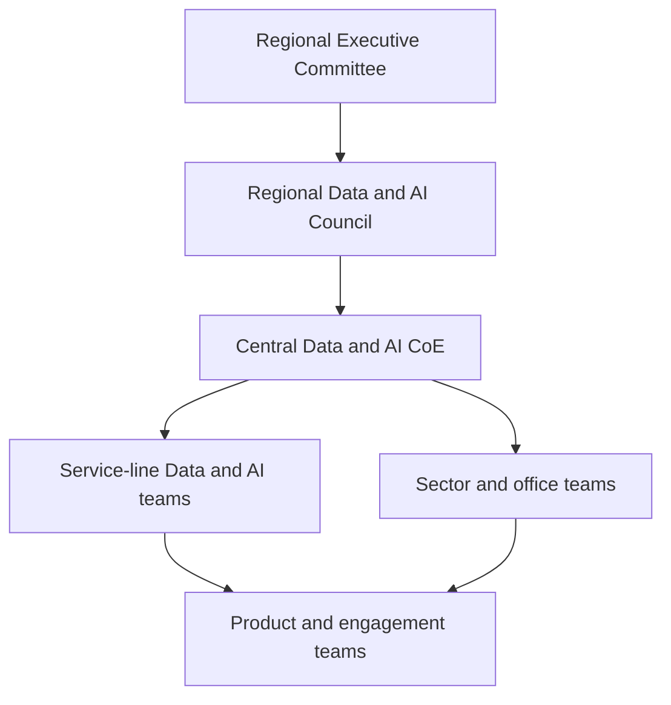

A Big Four firm should establish a regional Data & AI Centre of Excellence to coordinate how Data and AI transform internal operations, embed into client services, convert into scalable commercial propositions, and operate under trusted governance—without becoming a disconnected innovation laboratory.

{/* truncate */}

<ExecSummary>
Build a federated regional CoE: a central hub owns strategy, architecture, platforms, governance and reusable assets; service lines own propositions, delivery and revenue. Mobilise in 100 days, prove value in Year 1, scale in Year 2, and differentiate in Year 3. Judge success by repeatable, measurable, trusted outcomes—not by the number of pilots or presentations.
</ExecSummary>

<WhenToUse>
- Use when designing or mobilising a regional Data & AI CoE for a professional-services firm or large multi-business-unit enterprise.
- Pair with the [Data & AI CoE roadmap](/roadmaps/data-ai-centre-of-excellence), [AI Consulting Strategy, Frameworks and Roadmap](/articles/ai-consulting-strategy-frameworks-roadmap), [Responsible AI governance](/docs/frameworks/responsible-ai-governance), [NIST / EU AI Act governance](/articles/ai-governance-nist-eu-ai-act) and [Mobilisation frameworks](/docs/frameworks/mobilisation).
- Treat the charter, inventory, risk tiers, portfolio scorecard and 100-day plan as mandatory mobilisation artefacts.
- Pair portfolio start/continue/scale/pause/stop discipline with [Leadership: How to Set Direction and Priorities](/articles/leadership-set-direction-and-priorities).
- Practise senior engagement with [Leadership: How to Engage with Business and Service-Line Leaders](/articles/leadership-engage-business-service-line-leaders).
</WhenToUse>

**Operating scope:** one regional member firm or territory  
**Business coverage:** Audit and Assurance, Tax, Deals, Consulting, Risk, Legal where applicable, and Internal Business Services  
**Delivery horizon:** three years  
**Initial mobilisation:** first 100 days  
**Operating model:** federated hub-and-spoke Centre of Excellence

---

## 1. Executive summary

The Regional Data & AI CoE should become the regional operating system for Data and AI. Its purpose is to connect:

> Firm strategy → Client needs → Business capabilities → Data → Technology → Delivery → Risk → Adoption → Commercial value

The recommended model is a **federated regional CoE**:

| Layer | Owns |
| --- | --- |
| Central regional team | Strategy, architecture, governance, platforms, reusable assets |
| Service lines | Client propositions, industry solutions, engagement delivery, revenue |
| Internal functions | Business transformation and operational benefits |
| Regional offices and sectors | Local adoption and market activation |
| Product teams | Build, deploy and operate specific Data and AI capabilities |
| Global network | Shared technology, standards and intellectual property where available |

The CoE should be judged by whether it creates **repeatable, measurable and trusted outcomes**—not by the number of experiments, models or presentations it produces.

---

## 2. Why a Big Four firm needs a Data & AI CoE

A Big Four organisation faces challenges that differ from those of a normal corporate enterprise. The firm must manage Data and AI across multiple service lines, regulated professional services, thousands of client engagements, highly confidential client information, independence and conflict requirements, local member-firm obligations, and global network standards.

Without a coordinated CoE, seven failure patterns emerge.

### 2.1 Fragmented development

Different service lines build similar tools independently—document-review assistants, extraction platforms, retrieval systems—each recreating authentication, ingestion, vector search, evaluation, logging, UI and security. This multiplies cost and fragments risk management.

### 2.2 Uncontrolled experimentation

Employees may use public AI services without understanding confidentiality restrictions, retention arrangements, IP implications, model-training terms, regulatory obligations, accuracy limits or professional accountability.

### 2.3 Innovation that does not scale

Firms generate numerous prototypes but struggle to convert them into production services, repeatable client offerings, approved engagement tools, reusable accelerators, managed services or scalable revenue.

### 2.4 Weak commercial ownership

Technology teams may build useful capabilities without a clear market, sales strategy, pricing model, service-line sponsorship, route to engagement delivery or named revenue accountability.

### 2.5 Governance that arrives too late

Legal, risk, privacy, independence and information-security teams are often involved only before launch—creating delays, redesign, unresolved risk and abandoned investment.

### 2.6 Inconsistent client experience

Clients receive different answers about the firm’s AI capabilities depending on which partner, service line, office or technology team they speak with.

### 2.7 Difficulty demonstrating value

Activity metrics (pilots, users, ideas, training completions) proliferate while revenue, margin, hours avoided, work quality, risk reduction, client satisfaction, reuse and time-to-production remain weakly measured.

The CoE must solve these enterprise problems.

---

## 3. Vision, mission and strategic outcomes

### 3.1 Vision

> To make trusted Data and AI a core capability of the regional firm, improving how the organisation serves clients, delivers professional work, operates its business and develops its people.

### 3.2 Mission

> The Regional Data & AI Centre of Excellence will help the firm identify, build, govern, scale and commercialise high-value Data and AI capabilities across all service lines and internal functions.

### 3.3 Strategic outcomes

| Outcome category | Examples |
| --- | --- |
| **Client value** | Faster insight, higher-quality analysis, personalised services, new AI-enabled products, stronger relationships |
| **Commercial growth** | Consulting revenue, managed services, cross-service-line sales, higher win rates, market differentiation |
| **Delivery productivity** | Reduced manual work, faster research and document review, better knowledge discovery and engagement management |
| **Quality and risk** | Consistent controls, traceability, client-data protection, human oversight, incident management |
| **Workforce capability** | AI literacy, solution-shaping skills, specialist career paths, responsible adoption |
| **Enterprise capability** | Shared platforms, reusable components, common architecture, portfolio transparency, stronger vendor management |

---

## 4. Scope of the CoE

### 4.1 In scope

| Domain | Includes |
| --- | --- |
| **Data** | Strategy, architecture, governance, quality, metadata, lineage, data products, master/reference data, AI-ready data |
| **Artificial intelligence** | ML, predictive analytics, generative AI, LLMs/SLMs, vision, speech, multimodal, agents, decision support, intelligent automation |
| **Engineering and operations** | Data/AI engineering, MLOps, LLMOps, AgentOps, evaluation, observability, platform engineering, AI security, FinOps |
| **Commercialisation** | Market propositions, industry solutions, sales enablement, accelerators, managed services, pricing, alliances |
| **Governance** | Responsible AI, system registration, risk classification, privacy, security, model risk, legal/IP, third-party and client-contract risk |
| **People and adoption** | Literacy, technical training, product management, leadership education, communities, workforce redesign |

### 4.2 Out of scope

The CoE should **not** directly own every client engagement, every service-line proposition, all analytics reporting, every software application, all local delivery resources, final engagement quality, all technology procurement, business-unit P&L, all regulatory accountability, or every automation project.

It provides the common system through which these activities are coordinated.

---

## 5. Big Four-specific design principles

1. **Client confidentiality comes first** — no capability may compromise engagement restrictions, privilege, residency, professional secrecy or information barriers.
2. **Professional judgement cannot be delegated blindly** — define where AI may recommend, summarise, classify, draft, predict, detect or automate, and where human review is mandatory.
3. **Independence and conflicts must be considered early** — especially for audit, managed services, technology implementation and data access.
4. **Reuse should be the default** — check global, regional, service-line, commercial and prior-engagement assets before building.
5. **Global alignment, regional accountability** — use network assets where appropriate; remain accountable for regional regulation, clients, delivery and commercial outcomes.
6. **Products rather than temporary projects** — owners, roadmaps, persistent funding, SLAs, support, lifecycle and retirement.
7. **Risk-based governance** — a low-risk productivity assistant must not follow the same path as systems supporting audit conclusions, tax advice or recruitment decisions.
8. **Business value before technical novelty** — every investment links to revenue, margin, quality, speed, risk reduction or experience.
9. **Shared platforms, distributed innovation** — the CoE builds the foundation; service lines innovate on top.
10. **Responsible AI throughout the lifecycle** — from ideation through retirement.

---

## 6. Target operating model

Six organisational layers:

| Layer | Role |
| --- | --- |
| **1. Regional Executive Committee** | Strategic direction, investment approval, risk appetite, senior accountability |
| **2. Regional Data & AI Council** | Priorities, portfolio, platforms, Responsible AI policy, commercialisation, benefits |
| **3. Central Data & AI CoE** | Strategy, architecture, platforms, Responsible AI, portfolio, standards, talent, commercial enablement, assurance |
| **4. Service-line Data & AI teams** | Propositions, domain use cases, engagement delivery, industry solutions, revenue, specialist talent |
| **5. Sector and regional-office teams** | Local demand, industry relevance, adoption, partnerships, market activation |
| **6. Product and engagement teams** | Build/operate reusable capabilities; apply approved capabilities to client work |

---

## 7. CoE capability model — twelve pillars

### 7.1 Strategy and executive alignment

Translate firm strategy into a clear Data and AI agenda: three-year roadmap, investment themes, market positioning, maturity assessment and executive scorecard.

Typical strategic themes: workforce productivity, client delivery, trusted AI assurance, industry transformation, data modernisation, agentic processes, managed services, Responsible AI, AI security and cost optimisation.

### 7.2 Portfolio, investment and value management

Manage intake, business cases, prioritisation, funding allocation, benefits tracking and stop/scale decisions.

**Portfolio categories**

| Category | Purpose | Examples |
| --- | --- | --- |
| Internal transformation | Improve firm operations | Proposal development, knowledge search, finance ops, resource scheduling |
| Engagement enablement | Improve client delivery | Research assistants, document review, evidence classification, quality checks |
| Client propositions | Services sold to clients | AI strategy, governance, security, platforms, assurance, industry solutions |
| Managed services | Ongoing operated services | Model monitoring, governance ops, red teaming, data-quality operations |
| Strategic foundations | Cross-firm capabilities | Model gateway, AI inventory, data catalogue, evaluation, monitoring, IAM |

**Portfolio scoring model**

| Criterion | Weight |
| --- | ---: |
| Strategic alignment | 15% |
| Revenue or financial value | 20% |
| Client or employee impact | 10% |
| Reusability | 15% |
| Data readiness | 10% |
| Technical feasibility | 10% |
| Risk complexity | 10% |
| Time to value | 5% |
| Adoption readiness | 5% |

**Funding stages:** Discovery → Proof of value → Production → Scale.

### 7.3 Data strategy, governance and data products

Provide trusted, accessible, reusable data. Establish domains (client, engagement, opportunity, proposal, contract, employee, skill, project, time and billing, finance, supplier, risk, independence, knowledge, deliverable, industry/market), appoint executive data owners, data-product owners, stewards and technical custodians, and enforce an AI-ready data checklist before any AI use.

### 7.4 AI architecture and shared platforms

Provide an approved foundation: model access and gateway, secure development, knowledge/retrieval, deployment and operations.

The **model gateway** should provide SSO, RBAC, client/engagement separation, data classification, approved-provider routing, prompt/response logging, sensitive-data detection, rate and cost limits, safety controls, version control, fallback, regional processing, policy enforcement and usage attribution.

**Multi-tenancy** must support client-, engagement- and service-line separation, entitlements, encryption contexts where required, tenant-specific logging, access revocation, retention by engagement and residency requirements.

### 7.5 AI engineering and solution delivery

Standard lifecycle: Discover → Assess → Design → Build → Validate → Deploy → Operate → Retire. Every production capability needs documented architecture, source control, automated/security/performance testing, evaluation datasets, monitoring, human escalation, rollback, support ownership and change control.

### 7.6 Responsible AI, risk and assurance

Maintain an **AI-system inventory** and apply **risk tiers**:

| Tier | Examples | Controls |
| --- | --- | --- |
| 1 Low | General writing, non-sensitive meeting summary | Approved tools, guidance, basic monitoring, automated registration |
| 2 Moderate | Knowledge assistants, proposal support, classification | Impact assessment, data review, evaluation, named owner, monitoring |
| 3 High | Audit evidence, tax/legal interpretation, recruitment, regulatory reporting | Detailed impact assessment, independent validation, strong oversight, formal approval, recertification |
| 4 Prohibited | Illegal use, confidentiality breach, independence circumvention, unsupported professional conclusions | Block |

Use three lines of defence: product/service teams (first), risk/privacy/security/Responsible AI (second), internal audit or independent assurance (third).

### 7.7 AI security

Address prompt injection, data leakage, insecure tool use, model theft, supply-chain compromise, agent misuse, cross-client exposure and related threats with identity, data protection, model, agent, monitoring and incident-response controls. Pair with [Enterprise AI Security](/roadmaps/enterprise-ai-security) and [OWASP LLM Top 10 governance](/articles/owasp-llm-top-10-governance).

### 7.8 Commercial propositions and go-to-market

Coordinate a proposition portfolio spanning strategy/operating model, governance and risk, security, technology and engineering, data, workforce and change, assurance and managed services.

Every proposition needs a defined client problem, target buyer, outcome, delivery method, reusable assets, risk classification, pricing, sales materials, demo/case study and delivery training.

**CoE** creates reusable capability and supports pursuits; **service lines** own relationships and revenue; **sectors** tailor propositions; **alliances** provide co-selling and technology depth.

### 7.9 Reusable assets and intellectual property

Asset categories: frameworks, assessment tools, reference architectures, code libraries, data models, prompt libraries, evaluation datasets, control libraries, playbooks, taxonomies, demos, training and benchmarks.

Lifecycle: Submit → Review → Productise → Publish → Maintain → Retire. Confirm ownership, client-data removal, contractual restrictions, third-party licensing and open-source obligations before reuse.

### 7.10 Talent, skills and career pathways

Segment the workforce (all employees, client-facing professionals, leaders/partners, product managers, practitioners, risk/legal/compliance, sales) and define levels from AI aware → enabled → practitioner → leader → specialist. Create pathways for data/AI engineers, architects, product managers, Responsible AI, security, model-risk, transformation, commercial and assurance specialists.

### 7.11 Adoption and change management

Every initiative must answer who must work differently, what behaviour changes, what skills and incentives are required, how leaders will reinforce change, and how adoption will be measured (active/repeat usage, time saved, quality, drop-off, overrides, business outcomes).

### 7.12 Vendor, alliance and commercial management

Assess security, privacy, location, retention, training terms, audit rights, IP, exit options and Responsible-AI capability. Avoid excessive dependence on one cloud, model provider, integrator or proprietary framework.

---

## 8. Service-line integration

| Service line | Illustrative use cases | Extra controls |
| --- | --- | --- |
| **Audit and Assurance** | Evidence classification, extraction, anomaly detection, journal analysis, workpaper summarisation, quality review | Methodology, independence, evidence reliability, reproducibility, inspection readiness |
| **Tax** | Legislative research, reconciliation, classification, scenario modelling, compliance workflows | Jurisdiction, effective date, source authority, version control |
| **Deals** | Due-diligence review, financial extraction, contract analysis, synergy identification | Inside information, access segregation, conflict management |
| **Consulting** | AI strategy, platforms, agents, governance, security, managed services | Cross-service-line proposition ownership (not exclusive to Consulting) |
| **Risk and assurance services** | AI governance, model risk, regulatory readiness, AI assurance and security | Independence when challenging internal systems |
| **Internal business services** | Employee support, skills matching, resource scheduling, invoice processing, proposal and contract review | HR/privacy sensitivity, process redesign with adoption |

AI should support professional work without creating unsupported conclusions or weakening professional scepticism.

---

## 9. Use-case intake and prioritisation

1. **Submit** — problem, users, current process, value, data, AI role, risk, sponsor, owner, reuse opportunity.
2. **Triage** — reuse, join another initiative, discover, return for information, or stop.
3. **Discovery** — validate need, baseline, volume, value, data, technology, risk, adoption, commercial potential.
4. **Portfolio scoring** — apply the common criteria.
5. **Stage-gate decision** — stop, fund discovery, fund PoV, move to production, or scale.
6. **Product registration** — identifier, sponsor, owner, funding, risk tier, team, outcomes, reporting cadence.

---

## 10. Standard business case

Every material initiative should cover: problem statement, target outcome, baseline, proposed solution (what AI will and will not do), data, technology, risk, adoption, economics and measurable success criteria across product, business, adoption, risk, operational and commercial dimensions.

---

## 11. Product and delivery governance

Five ownership roles must be clear before production:

| Role | Accountable for |
| --- | --- |
| Product owner | Outcomes, roadmap, priorities, adoption, benefits, lifecycle |
| Technical owner | Architecture, engineering quality, security, reliability, technical debt |
| Risk owner | Risk assessment, controls, residual risk, escalation |
| Operations owner | SLAs, support, monitoring, incidents, continuity |
| Benefit owner | Baseline, benefit measurement, financial validation, realisation |

---

## 12. Governance forums and cadence

| Forum | Cadence | Focus |
| --- | --- | --- |
| Regional Data & AI Council | Monthly | Strategy, portfolio, major risks, investment, benefits, commercial |
| Portfolio Committee | Fortnightly | Proposals, stage gates, delivery health, stop decisions |
| Responsible-AI and Risk Committee | Fortnightly / as required | High-risk systems, assessments, incidents, exceptions, recertification |
| Architecture Review Board | Weekly | Architecture, platforms, integrations, model choices, security |
| Data Governance Council | Monthly | Ownership, quality, access, lineage, data products |
| Service-line AI forums | Monthly | Pipeline, adoption, propositions, skills, reuse |
| Community of practice | Monthly | Demos, lessons, technical sessions, networking |

---

## 13. Funding model

| Funding type | Covers |
| --- | --- |
| Central foundation | Platforms, governance, architecture, security, core CoE staff, shared components, inventory, observability |
| Innovation | Discovery, experiments, PoVs, market testing, new propositions |
| Service-line | Service-line products, industry propositions, accelerators, delivery capability |
| Internal-function | Operational transformation, process redesign, change, support |
| Engagement | Client-specific configuration, integration, delivery and controls |

**Principles:** shared foundations centrally funded; business owners fund production adoption; client-specific work is normally engagement-funded; successful propositions contribute to maintenance; weak initiatives lose continuous funding; Finance validates benefits.

---

## 14. Commercial and cost management

Track cloud, inference, training, fine-tuning, embeddings, vector storage, data movement, monitoring, licences, development, support, assurance and training. Measure unit economics per user, prompt, document, workflow, engagement, client and successful outcome. Control cost with budgets, quotas, model routing, caching, small-model-first policies, batch processing, prompt/retrieval optimisation, storage lifecycle and chargeback/showback. See [Model FinOps](/roadmaps/model-finops).

---

## 15. Performance measurement

| Category | Example metrics |
| --- | --- |
| Commercial | AI-related revenue, pipeline, win rate, active propositions, managed-service revenue, reuse, CSAT |
| Internal value | Hours saved, cost avoided, cycle-time reduction, quality, employee satisfaction, benefit realised |
| Delivery | Idea→discovery→PoV→production times, conversion rate, availability, incident rate |
| Reuse | Components reused, engagements on shared assets, duplicate tools retired, catalogue adoption |
| Risk | Registered systems by tier, control gaps, incidents, exposures, recertification, overrides, performance breaches |
| People | Literacy completion, certifications, champions, community participation, specialist retention |

---

## 16. Illustrative organisation structure

**CoE leadership:** Regional Data & AI CoE Leader, Chief of Staff, Strategy Director, Portfolio and Value Director.

**Core capability leads:** Heads of Data, AI Engineering, AI Platforms, Responsible AI, AI Security, AI Products, Commercialisation, Adoption and Skills, AI Operations, Alliances and Vendors.

**Federated leadership:** Audit, Tax, Deals, Consulting, Risk, Internal Functions Data & AI Leads; Sector and Office/subregional AI Leads.

---

## 17. Illustrative staffing

| Phase | Size | Focus |
| --- | --- | --- |
| Initial mobilisation | 20–30 | Leader, strategy/ops, portfolio, architecture/engineering, data, Responsible AI/privacy/security, adoption, commercial, product ops |
| Year-one central team | 50–90 | Permanent platform, governance, product, engineering and commercial capability |
| Federated network | 150–400 | Service-line practitioners, data teams, architects, PMs, risk specialists, champions, sector and office leads |

The central CoE should remain focused on enterprise enablement rather than owning every delivery resource.

---

## 18. First 100-day mobilisation plan

### Days 1–20: Establish direction

Appoint the CoE leader and executive sponsor; approve the charter; define scope; establish forums; map teams, platforms, vendors and existing AI systems; identify uncontrolled usage; review global capabilities; agree initial investment.

**Outputs:** approved charter, leadership structure, initial inventory, current-state assessment, governance calendar, initial budget.

### Days 21–40: Assess and prioritise

Maturity assessment; service-line and internal-function interviews; priority client and internal opportunities; platform and data-readiness gaps; policy and risk review; portfolio criteria.

**Outputs:** maturity report, opportunity map, risk map, platform gap assessment, prioritisation framework, candidate portfolio.

### Days 41–60: Design the operating model

Confirm central/federated responsibilities, decision rights, product ownership, intake, risk tiers, architecture principles, data governance, skills framework, commercial process and funding model.

**Outputs:** TOM, governance framework, RACI, delivery lifecycle, risk classification, funding model, skills framework.

### Days 61–80: Launch foundations

AI-system inventory; approved model access; architecture review; interim AI-use policy; priority data remediation; champion network; executive and role-based training; asset catalogue; portfolio reporting.

**Outputs:** inventory, approved tool catalogue, interim policy, training pathways, asset catalogue, portfolio dashboard.

### Days 81–100: Start delivery

Launch five to eight priority initiatives with named product owners and baselines; begin PoV work; launch one or two client propositions, one internal productivity product and one governance/assurance service; establish benefits tracking; publish the three-year roadmap.

**Outputs:** active priority portfolio, business cases, initial propositions/products, three-year roadmap, executive scorecard.

```mermaid
gantt
  title First 100 days
  dateFormat X
  axisFormat %s
  section Mobilise
  Establish direction           :a1, 0, 20
  Assess and prioritise         :a2, 20, 40
  Design operating model        :a3, 40, 60
  Launch foundations            :a4, 60, 80
  Start delivery                :a5, 80, 100
```

---

## 19. Year-one roadmap

| Quarter | Focus | Key moves |
| --- | --- | --- |
| **Q1 Mobilise** | Leadership, strategy, inventory, governance, priorities, training, platform assessment |
| **Q2 Build foundations** | Model gateway, evaluation framework, asset catalogue, data domains, risk-tiered approval, reusable components, initial propositions |
| **Q3 Prove value** | Deliver products, measure benefits, convert PoVs to production, sector pilots, sales enablement, observability, FinOps |
| **Q4 Scale** | Expand adoption, retire duplicates, managed-service concepts, regional coverage, value report, year-two investment |

---

## 20. Three-year roadmap

| Year | Primary objective | Key outcomes |
| --- | --- | --- |
| **Year 1 — Establish and prove** | Create trust, shared foundations and visible value | CoE live, governance operating, inventory, initial platforms, priority products, first propositions, foundational training, demonstrated benefits |
| **Year 2 — Scale and integrate** | Embed across service lines and functions | Wider production adoption, sector propositions, managed services, scaled data products, office connectivity, asset reuse, value-linked funding, mature AI ops |
| **Year 3 — Differentiate and optimise** | Make Data and AI a core competitive advantage | AI in major offerings, strong recurring revenue, mature assurance, advanced agentic workflows, cross-service-line propositions, regional IP, optimised cost/performance, market differentiation |

---

## 21. Maturity model

| Level | Characteristics |
| --- | --- |
| **1 Fragmented** | Isolated experiments, unclear ownership, limited governance, duplicate tools, weak value measurement |
| **2 Coordinated** | CoE established, initial standards, portfolio visibility, approved tools, early training |
| **3 Industrialised** | Shared platforms, product teams, repeatable delivery, monitoring, strong governance, demonstrated value |
| **4 Scaled** | Enterprise adoption, reusable propositions, regional coverage, integrated data products, mature commercial model |
| **5 Differentiated** | AI-enabled business model, strong market position, advanced managed services, continuous innovation, measurable advantage |

---

## 22. Critical artefacts

| Pack | Artefacts |
| --- | --- |
| Strategy | Data & AI strategy, three-year roadmap, annual plan, investment portfolio, market proposition map |
| Governance | Charter, AI policy, Responsible-AI framework, risk taxonomy, inventory, impact-assessment template, incident and recertification processes |
| Delivery | Intake form, discovery and business-case templates, architecture template, evaluation plan, production-readiness and retirement checklists, runbooks |
| Data | Domain map, owner register, data-product template, quality framework, access standard, AI-ready checklist |
| Technology | Reference architecture, model and vendor catalogues, platform service catalogue, engineering/monitoring/security standards |
| Commercial | Proposition template, pricing model, sales playbook, demo catalogue, case-study template, alliance plan, pipeline dashboard |
| People | Skills taxonomy, learning pathways, career framework, champion handbook, community plan, leadership briefing |

---

## 23. Major implementation risks

| Risk | Consequence | Mitigation |
| --- | --- | --- |
| Too centralised | Service lines disengage | Federated ownership, joint funding, clear SLAs, proportionate governance |
| Only advisory | Frameworks without capability | Own platforms, components, portfolio reporting; deliver lighthouse products |
| Too many pilots | Thin investment, low conversion | Stage-gate funding, small strategic portfolio, stop criteria |
| Weak business ownership | Built but not adopted | Named product and benefit owners, business funding, adoption plans |
| Late-stage risk blockers | Delay and distrust | Embed risk early, risk tiers, reusable controls, automate low-risk approval |
| Global/regional duplication | Rebuild existing assets | Global asset review, shared roadmaps, formal reuse |
| Platform dependency | Single-provider lock-in | Model abstraction, portability, exit clauses, multi-provider testing |
| Poor measurement | Unclear ROI | Baselines, Finance validation, unit economics, quarterly value reviews |
| Confidentiality failure | Legal, regulatory, reputational damage | Tenant isolation, approved models, monitoring, training, incident response |
| Skills concentrated centrally | CoE bottleneck | Federated practitioners, pathways, champions, embedded specialists |

---

## 24. Success conditions

The CoE is likely to **succeed** when regional leadership gives it real authority; service-line leaders share ownership; outcomes are measurable; foundations are centrally funded; product owners are accountable; risk teams engage from the start; reuse is rewarded; weak work is stopped; adoption is part of delivery; global assets are used intelligently; and commercial and internal outcomes are balanced.

It is likely to **fail** when treated as an innovation lab; it owns no platforms or standards; it becomes a large central delivery factory; every use case gets equal priority; governance is manual and slow; business leaders do not own benefits; propositions disconnect from delivery; the organisation measures activity instead of value; global and regional teams compete; or employees cannot access approved tools easily.

---

## 25. Final target state

A mature Regional Data & AI CoE should make the following possible:

1. A service line can identify an opportunity and obtain rapid support.
2. Teams use approved platforms rather than rebuilding foundations.
3. Data access is controlled, traceable and efficient.
4. Risk requirements are known from the beginning.
5. Products are evaluated against clear business and professional criteria.
6. Successful capabilities move from pilot to production.
7. Reusable assets apply across engagements.
8. Client propositions go to market consistently.
9. Regional offices have equal access to capability.
10. Leadership sees investment, risk, adoption and value in one portfolio.
11. Employees know how to use AI safely and effectively.
12. The firm can demonstrate that AI-enabled work is secure, responsible and professionally reliable.

The final objective is not to build more AI solutions. It is to create an organisation that can repeatedly:

> Identify important problems, use trusted data, design appropriate solutions, apply strong professional judgement, manage risk, achieve adoption and convert Data and AI into measurable client and organisational value.

<KeyTakeaways>
- Treat the CoE as the regional operating system for Data and AI—not a lab.
- Federate: central foundations, service-line ownership of propositions and revenue.
- Mobilise with charter, inventory, risk tiers and a 100-day plan before scaling investment.
- Fund Discovery → PoV → Production → Scale; stop weak work early.
- Measure commercial, internal, delivery, reuse, risk and people outcomes—not pilot count.
</KeyTakeaways>

<NextSteps>
- Follow the stage-by-stage [Data & AI Centre of Excellence roadmap](/roadmaps/data-ai-centre-of-excellence).
- Set direction and portfolio choices with [Leadership Direction and Priorities](/roadmaps/leadership-direction-priorities) and [Leadership: How to Set Direction and Priorities](/articles/leadership-set-direction-and-priorities).
- Engage sponsors and service lines with [Leadership Business Engagement](/roadmaps/leadership-engage-business-leaders) and [How to Engage with Business and Service-Line Leaders](/articles/leadership-engage-business-service-line-leaders).
- Shape client propositions with [Leadership in Shaping Major Data and AI Client Opportunities](/articles/leadership-shaping-major-data-ai-client-opportunities) and the [Client Opportunity Shaping roadmap](/roadmaps/leadership-client-opportunity-shaping).
- Reuse mobilisation artefacts from [Mobilisation and Decision Frameworks](/docs/frameworks/mobilisation) and stage gates from the [VALUE gate](/docs/ai-solution-engineering/value-gate).
- Align governance with [Responsible AI governance](/docs/frameworks/responsible-ai-governance) and [NIST AI RMF / EU AI Act](/articles/ai-governance-nist-eu-ai-act).
- Connect commercialisation to [AI Consulting Strategy](/articles/ai-consulting-strategy-frameworks-roadmap) and cost discipline to [Model FinOps](/articles/model-finops-cost-engineering-roadmap).
</NextSteps>
